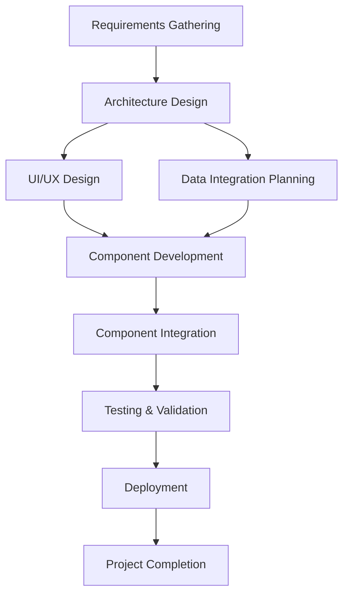

# Dashboard Development Framework (BMAD-Adapted)

A systematic, agent-driven framework for building professional control panels and dashboards, adapted from the proven BMAD-METHOD structure.

## Overview

This framework provides a comprehensive workflow for creating high-quality dashboards and control panels that are data-driven, interactive, and professionally implemented. It combines the structured approach of BMAD-METHOD with specialized expertise for dashboard development.

## Key Features

- **Agent-Based Workflow**: Specialized AI agents for each aspect of dashboard development
- **Systematic Process**: Structured workflow from requirements to deployment
- **Professional Quality**: Senior engineer level code standards and implementation
- **Complete Delivery**: Framework drives to fully deployed, working dashboards
- **Proven Structure**: Built on battle-tested BMAD-METHOD architecture

## Architecture

### Core Agents

1. **Dashboard Architect** (`dashboard-architect`) - Technical architecture and system design
2. **UI/UX Designer** (`ui-designer`) - Visual design and user experience
3. **Data Integration Specialist** (`data-integrator`) - Backend data connections and processing
4. **Component Developer** (`component-dev`) - Interactive component implementation
5. **Testing & Validation Specialist** (`dashboard-qa`) - Quality assurance and testing
6. **Dashboard Orchestrator** (`dashboard-orchestrator`) - Workflow coordination and guidance
7. **Dashboard Master** (`dashboard-master`) - Universal task executor for dashboard tasks

### Core Workflow



## Getting Started

### 1. Project Initialization

Start with the **Dashboard Orchestrator** to plan your project:

```bash
# Activate Dashboard Orchestrator
@dashboard-orchestrator

# Get workflow guidance
*guide
```

### 2. Requirements Gathering

Use the **Dashboard Master** to create comprehensive requirements:

```bash
# Activate Dashboard Master
@dashboard-master

# Create dashboard requirements
*requirements
```

This will create a comprehensive Dashboard Requirements Document (DRD) covering:
- User needs and use cases
- Data sources and integration requirements
- Functional specifications
- Technical constraints
- Performance and security requirements

### 3. Architecture Design

Use the **Dashboard Architect** to create technical specifications:

```bash
# Activate Dashboard Architect
@dashboard-architect

# Create dashboard architecture
*create
```

This will generate a detailed architecture document including:
- Technology stack selection
- System architecture design
- Data flow and integration patterns
- Security and performance architecture
- Development guidelines

### 4. UI/UX Design

Use the **UI/UX Designer** for visual design and user experience:

```bash
# Activate UI/UX Designer
@ui-designer

# Create dashboard mockups
*mockup
```

### 5. Component Development

Use the **Component Developer** for implementation:

```bash
# Activate Component Developer
@component-dev

# For each component:
*chart      # Create chart components
*control    # Create control components
*widget     # Create dashboard widgets
*table      # Create data table components
```

### 6. Data Integration

Use the **Data Integration Specialist** for backend connections:

```bash
# Activate Data Integration Specialist
@data-integrator

# Set up data connections
*connect    # Connect data sources
*api        # Set up API integrations
*stream     # Set up real-time data streams
```

### 7. Testing & Validation

Use the **Testing & Validation Specialist** for quality assurance:

```bash
# Activate Testing & Validation Specialist
@dashboard-qa

# Comprehensive testing
*test           # Test dashboard functionality
*performance    # Validate performance
*accessibility  # Test accessibility compliance
*security       # Validate security
```

## Framework Structure

```
control-panel-core/
├── agents/                     # Specialized AI agents
│   ├── dashboard-architect.md
│   ├── ui-designer.md
│   ├── data-integrator.md
│   ├── component-dev.md
│   ├── dashboard-qa.md
│   ├── dashboard-orchestrator.md
│   └── dashboard-master.md
├── tasks/                      # Executable workflows
│   ├── create-dashboard-requirements.md
│   ├── create-dashboard-architecture.md
│   └── [other task files]
├── templates/                  # Document templates
│   ├── dashboard-requirements-tmpl.yaml
│   ├── dashboard-architecture-tmpl.yaml
│   └── [other template files]
├── workflows/                  # Complete workflow definitions
│   └── dashboard-development-workflow.yaml
├── checklists/                # Quality assurance checklists
│   ├── dashboard-requirements-checklist.md
│   ├── component-development-checklist.md
│   └── [other checklist files]
├── data/                      # Knowledge base and references
└── core-config.yaml          # Framework configuration
```

## Technology Stack Recommendations

### Frontend Options

**React-Based (Recommended for Complex Dashboards)**
- React + TypeScript
- Material-UI or Ant Design for components
- Recharts or D3.js for visualizations
- Zustand for state management

**Python-Based (Recommended for Data Science Dashboards)**
- Streamlit for rapid prototyping
- Dash for interactive Python dashboards
- Panel for scientific computing

### Backend Options

- **FastAPI** (Python) - High performance, automatic documentation
- **Express.js** (Node.js) - Flexible, mature ecosystem
- **Flask** (Python) - Lightweight, simple
- **Django** (Python) - Full-featured, batteries included

### Database Options

- **PostgreSQL** - Reliable, feature-rich SQL database
- **MongoDB** - Flexible NoSQL for document storage
- **InfluxDB** - Time-series data for monitoring dashboards
- **Redis** - In-memory caching and real-time data

## Quality Standards

### Code Quality
- TypeScript for type safety (JavaScript projects)
- ESLint and Prettier for code formatting
- Comprehensive unit test coverage (>80%)
- Component testing and integration testing
- Code review and quality assurance

### Performance Standards
- Page load time < 3 seconds
- Interactive response time < 500ms
- Real-time updates without blocking UI
- Efficient handling of large datasets
- Mobile-responsive design

### Accessibility Standards
- WCAG AA compliance
- Screen reader compatibility
- Keyboard navigation support
- Proper color contrast ratios
- Semantic HTML structure

### Security Standards
- Input validation and sanitization
- Authentication and authorization
- Data encryption (at rest and in transit)
- API security and rate limiting
- Regular security vulnerability assessments

## Workflow Patterns

### Simple Dashboard Workflow
For straightforward dashboards with basic requirements:
1. Requirements → Architecture → Design → Development → Testing → Deployment

### Complex Dashboard Workflow
For advanced dashboards with multiple data sources and complex features:
1. Requirements → Architecture → Design → Data Integration → Component Development → Integration → Comprehensive Testing → Deployment

### Real-Time Dashboard Workflow
For dashboards requiring live data updates:
1. Requirements → Architecture → Real-Time Data Design → Component Development → Performance Testing → Deployment

## Best Practices

### Development Guidelines
- Follow established coding standards and conventions
- Write self-documenting code with clear variable names
- Implement proper error handling and user feedback
- Use established design patterns and component libraries
- Optimize for performance from the beginning

### Data Integration Guidelines
- Validate and sanitize all external data
- Implement proper caching strategies
- Handle network failures gracefully
- Use efficient data transformation patterns
- Monitor data quality and system health

### User Experience Guidelines
- Design for the user's mental model and workflows
- Provide clear visual hierarchy and information organization
- Implement intuitive navigation and interaction patterns
- Ensure accessibility for users with disabilities
- Test with real users and iterate based on feedback

## Troubleshooting

### Common Issues

**Agent Not Loading Properly**
- Ensure you're using the correct agent activation syntax
- Check that all dependencies are available
- Verify the agent file is not corrupted

**Template Generation Failing**
- Confirm all required template fields are provided
- Check for YAML syntax errors in template files
- Ensure user input validation is working

**Workflow Getting Stuck**
- Use the Dashboard Orchestrator to assess project status
- Check quality gates and acceptance criteria
- Verify all dependencies are met before proceeding

### Getting Help

1. Use the `*help` command with any agent
2. Check the agent's specific documentation
3. Review the workflow definition for guidance
4. Consult the quality checklists for requirements

## Examples and Use Cases

### Business Intelligence Dashboard
- Multiple data source integration
- Complex visualizations and drill-down capabilities
- User role-based access and permissions
- Export and sharing functionality

### Monitoring Dashboard
- Real-time system metrics and alerts
- Time-series data visualization
- Automated anomaly detection
- Mobile-responsive design for on-call access

### Analytics Dashboard
- User behavior tracking and analysis
- Funnel analysis and conversion metrics
- A/B testing results visualization
- Custom reporting and data export

## Contributing

This framework is designed to be extensible and customizable:

1. **Adding New Agents**: Create new agent files following the established pattern
2. **Custom Tasks**: Develop task files for specific dashboard needs
3. **Template Extensions**: Add new templates for different dashboard types
4. **Workflow Customization**: Modify workflows for specific project types

## License

This framework is built on the BMAD-METHOD foundation and follows the same MIT License structure.

---

## Quick Reference

### Essential Commands

```bash
# Project planning and coordination
@dashboard-orchestrator → *guide

# Requirements gathering
@dashboard-master → *requirements

# Architecture design
@dashboard-architect → *create

# Visual design
@ui-designer → *mockup

# Component development
@component-dev → *chart / *control / *widget

# Data integration
@data-integrator → *connect / *api

# Testing and validation
@dashboard-qa → *test / *performance

# Universal task execution
@dashboard-master → *task {task-name}
```

### Quality Gates

- ✅ Requirements complete and approved
- ✅ Architecture reviewed and validated
- ✅ Design mockups created and approved
- ✅ Components developed and tested
- ✅ Data integration working correctly
- ✅ Performance benchmarks met
- ✅ Accessibility compliance validated
- ✅ Security validation passed
- ✅ Deployment ready and verified

This framework ensures systematic, high-quality dashboard development that delivers professional results every time.